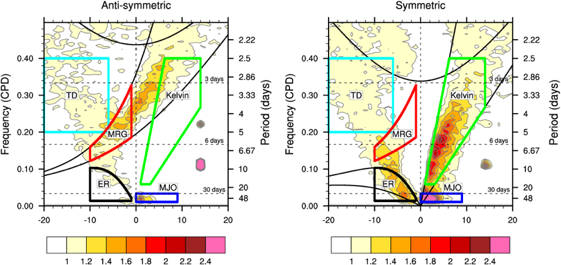

## 使用数据

NOAA Interpolated Outgoing Longwave Radiation (OLR)
- https://psl.noaa.gov/data/gridded/data.olrcdr.interp.html

Outgoing Longwave Radiation	Mean	Daily
- olr.day.mean.nc

或者可以从谷歌网盘下载ncl 滤波后的kelvin波nc数据

- [https://drive.google.com/file/d/15UINhhKpkUKkCC-ztB63gVsAE74RyCy_/view?usp=drive_link](https://drive.google.com/drive/folders/1Z4aBqjB7gmOjxY0tw-8ifmu1LxrdU2B3?usp=drive_link)

如果无法下载成功，可以邮件联系我：

xianpuji@hhu.edu.cn

## 代码功能介绍

该文件夹为大气数据（特别是 OLR 数据）创建了一个滤波器，以提取特定的赤道波模式，如开尔文波和赤道罗斯贝 (ER) 波

包含python代码和ncl代码，其中ncl代码用来验证python代码的滤波结果，python代码主要实现以下功能：

代码中ipynb中kf-filter的函数，在https://github.com/Blissful-Jasper/mcclimate/blob/master/kf_filter.py的基础上进行了封装和调整

- 1、使用 xarray 和 dask 加载 netCDF 数据以进行并行处理
- 2、执行数据预处理，包括去趋势
- 3、在频率波数空间中应用基于 FFT 的过滤
- 4、根据现有 NCL 输出验证结果
